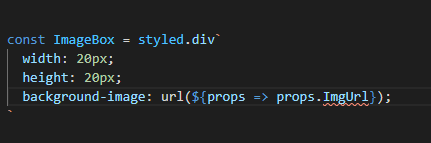
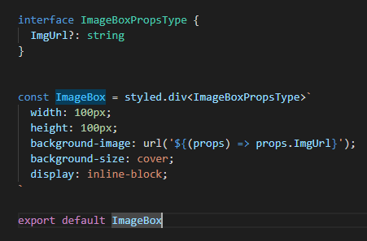

### 1. React에 TypeScript 적용

- npm i typescript
- npm i @types/react
- npm i @types/react-dom

### 2. Cannot use JSX unless the '--jsx' flag is provided.ts(17004)

- vscode 에서 설정을 잡지 못해서 생긴 오류
- https://louiskueh.medium.com/how-to-fix-cannot-use-jsx-unless-the-jsx-flag-is-provided-ts-17004-8f7e86ff3aac

### 3. styled-components

- typescript 적용시 발생 에러

  - 
  인터페이스를 적용해 줘야 함
    
  
- 화면에 중앙에 정렬

  ```css
  .class-name {
      
  }
  ```

  